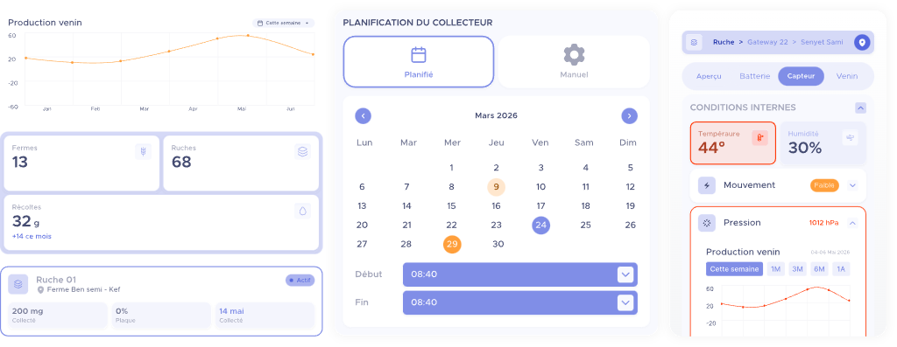
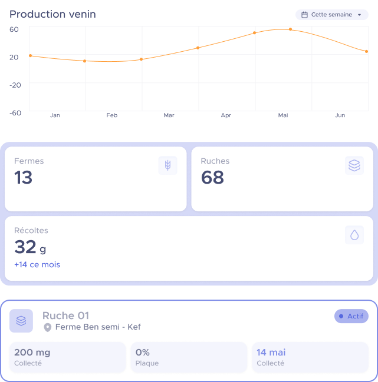
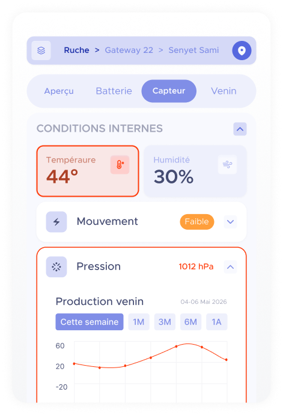

# 🐝 Nectaious — Beehive Monitor

Full-stack **beehive monitoring & apiary management platform** for beekeepers, farm administrators and venom-harvesting operations. Built as a final-year engineering project and production-minded from day one.




## 🎯 The problem

Small apiaries lose colonies to preventable issues — swarming, varroa pressure, battery-dead sensor nodes — because nobody watches raw telemetry 24/7. Nectaious turns hive sensors into **actionable alerts and role-scoped dashboards**: beekeepers see their own farms, admins manage everything, and every sensitive action leaves an audit trail.

## ✨ Features

- **Role-based portals** — `super-admin`, `admin` and `apiculteur` portals driven by a single permissions registry (`lib/auth/roles.ts`) that powers navigation, UI gating and API authorization
- **Custom stateless auth** — HMAC-SHA256-signed session cookies with constant-time verification, shared cookie/Bearer scheme across web and mobile, bcrypt password hashing. No NextAuth — built from scratch to fit the subscription model
- **Apiary management** — farms (`fermes`), hives (`ruches`), QR-code gateway pairing (scan via `expo-camera` with manual fallback), maintenance scheduling and intervention tracking
- **End-to-end IoT pipeline** — indexed time-series telemetry collection, time-bucketed aggregation (`1S` → `1A`), threshold alerts (e.g. battery < 20%) and a Python hardware simulator for demos and load testing
- **Append-only audit trail** — field-level diffs on every mutation, best-effort writes that never break requests, secrets redacted by design
- **Real-time presence** — heartbeat pings every 45 s power a live "admins connected" view
- **Subscription gating** — re-checked per request, so expired plans lose access mid-session
- **Mobile companion app** — Expo / React Native client sharing the same API and design language
- **Documented design system** — ~30 tokenized components, live `/style-guide` route, full token reference in [`docs/DESIGN-TOKENS.md`](docs/DESIGN-TOKENS.md)
- **UML documentation suite** — use-case, class and sequence diagrams plus the validation plan ([`docs/`](docs))

## 🏗️ Architecture

```
Web (Next.js 15 App Router, RSC)  ──┐
                                    ├──►  REST API (Route Handlers + middleware guards)
Mobile (Expo React Native)       ──┘         │                 │
                                              ▼                 ▼
                                        MongoDB (Mongoose)   Audit log
                                              ▲
Hive simulator (Python/Tkinter) ── telemetry ─┘        QR-paired ESP gateways (production)
```

Multi-package repo — web (root), `mobile/` and `simulator/` are installed and versioned independently.

## 🚀 Getting started

### Prerequisites

- Node.js ≥ 20
- MongoDB (local or Atlas)

### Web

```bash
npm install
cp .env.example .env.local
```

Set in `.env.local`:

| Variable | Required | Notes |
|---|---|---|
| `MONGODB_URI` | ✅ | e.g. `mongodb://localhost:27017/nectaious` |
| `SESSION_SECRET` | ✅ | 64-hex string — generate with `openssl rand -hex 32`. The server refuses to start without it |

```bash
npm run dev            # http://localhost:3000
npm run build          # production build (also type-checks)
```

Useful scripts (all run through `tsx --env-file=.env.local`): `seed`, `seed:fake`, `seed:clear-fake`, `db:check`, `verify-login`.

### Mobile

```bash
cd mobile
npm install
npx expo start
```

Optional: set `EXPO_PUBLIC_API_URL` to point at your API; otherwise it falls back to your Expo dev host (`http://<host>:3000/api`).

### Hive simulator

```bash
pip install -r simulator/requirements.txt
python simulator/simulator.py
```

> ⚠️ The target URL is hardcoded in `simulator/simulator.py` (`API_BASE_URL`) — edit it for local use.

Generate a QR code from the simulator, scan it in the mobile app, and watch telemetry land in the dashboards.

## 📸 Screenshots

| Overview | Sensor detail |
|---|---|
|  |  |

More in [`public/landing/`](public/landing).

## 📁 Project structure

```
app/            # App Router pages: (auth), (dashboard), api, style-guide
components/ui/  # Design-system components (~30, all documented)
lib/            # DB client, auth (sessions, roles, permissions), audit, helpers
models/         # Mongoose models (Farm, Hive, Telemetry, Alert, AuditLog…)
scripts/        # Seeders & maintenance scripts
simulator/      # Python hive telemetry simulator
docs/           # UML diagrams, design tokens, component docs, validation plan
mobile/         # Expo React Native companion app
```

## 🧪 Testing

No automated test suite yet — quality is currently gated by ESLint, strict TypeScript and `next build` in CI ([workflow](.github/workflows/ci.yml)). Manual validation covered QR pairing under varied lighting, session robustness and alert rules; see [`docs/TESTS-AND-VALIDATION.md`](docs/TESTS-AND-VALIDATION.md). `mongodb-memory-server` groundwork is already in devDependencies for the planned Jest suites.

## 🔭 Roadmap

- [ ] Jest unit tests + Playwright e2e (groundwork in place)
- [ ] Docker Compose for one-command local stack
- [ ] Deployment guide (Vercel + Atlas)
- [ ] Alert rule editor in the admin portal
- [ ] Store builds for the mobile app

## 📄 License

MIT — see [LICENSE](LICENSE).
