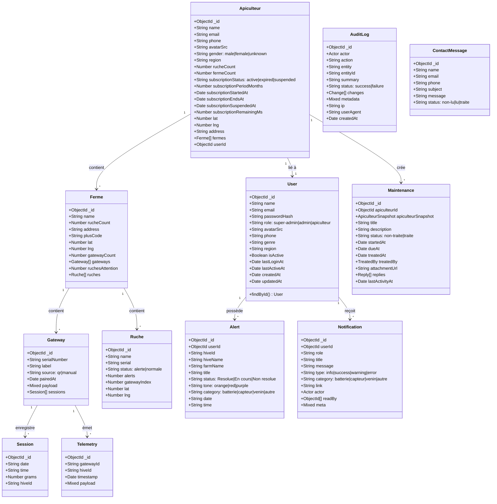
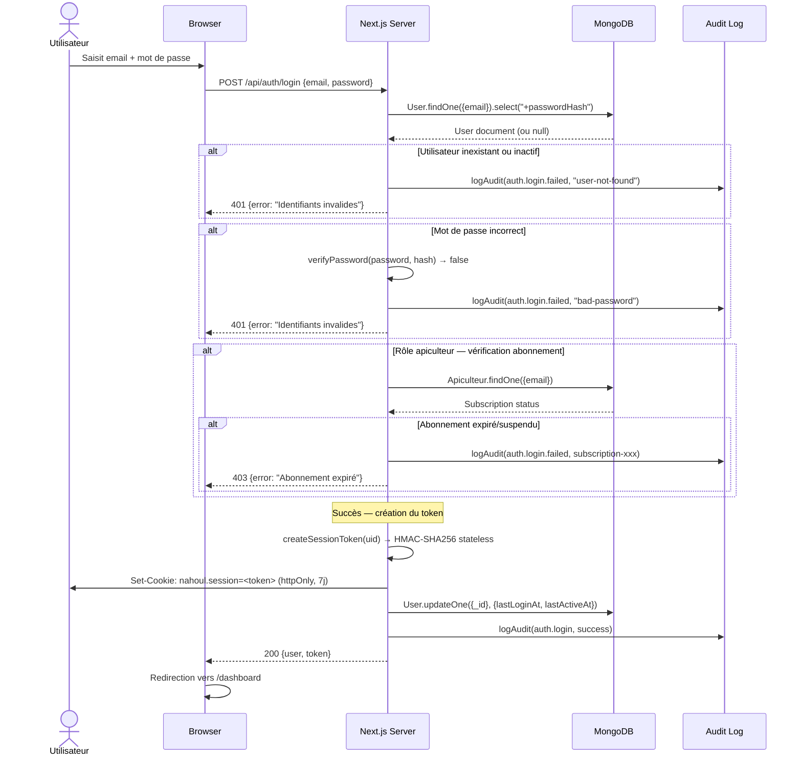
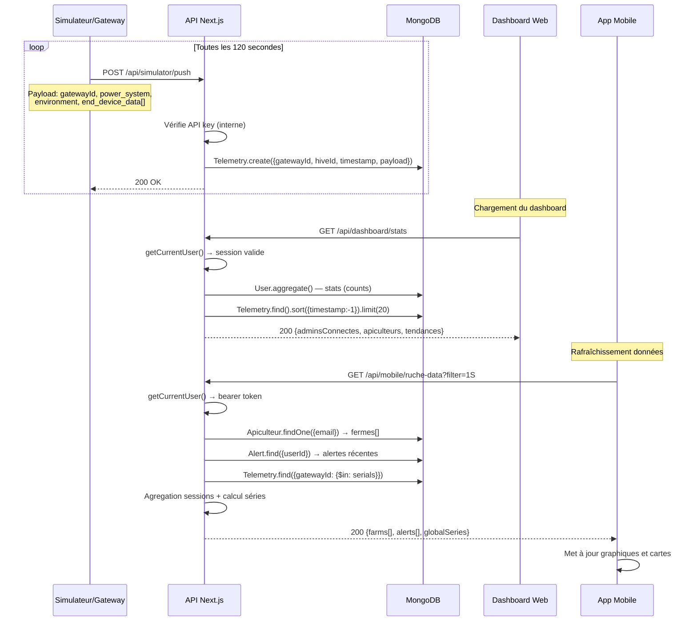
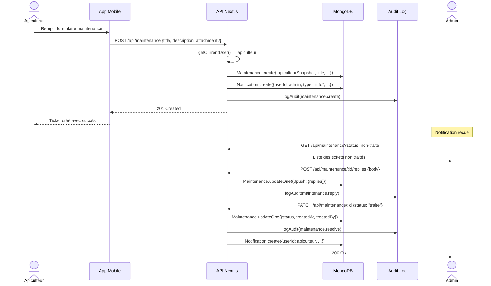
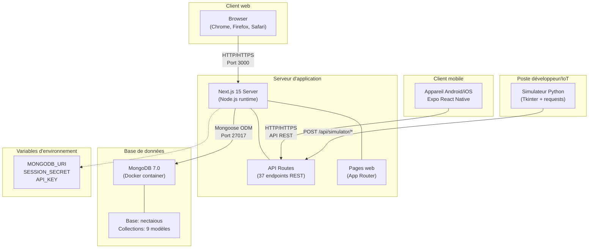
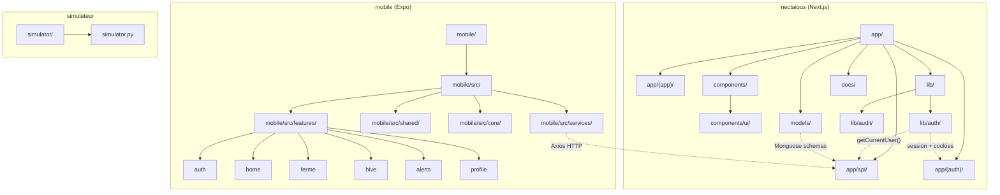
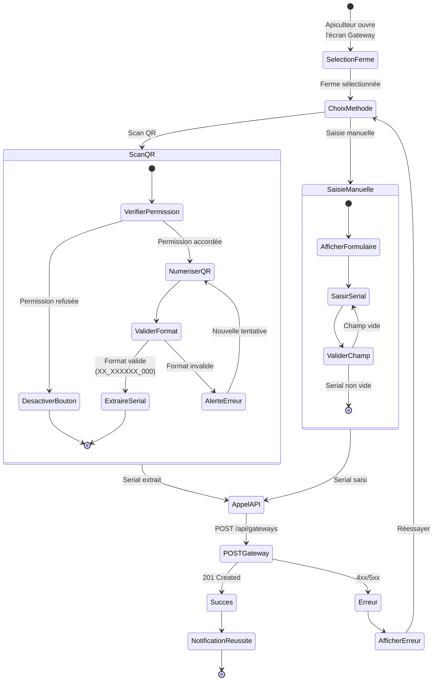
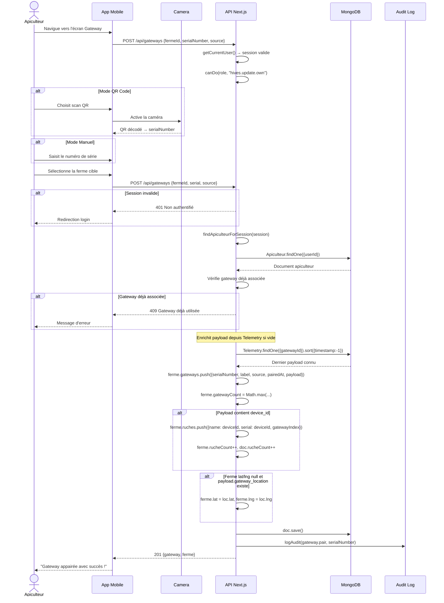

# Chapitre 4 — Réalisation et mise en œuvre

## 4.1 Introduction du chapitre

Ce chapitre présente la phase de réalisation concrète de la plateforme Nahoul, depuis la conception architecturale jusqu'au déploiement de la solution finale. Il est organisé en quatre parties complémentaires. La première détaille l'architecture globale et les choix techniques. La deuxième présente les diagrammes UML de conception. La troisième décrit le développement de chaque composant de la solution : application mobile, interface web, site vitrine, back-end et intégration IoT. La quatrième rend compte des tests et de la validation.

## 4.2 Architecture globale

### 4.2.1 Architecture technique

La plateforme Nahoul repose sur une architecture full-stack JavaScript/TypeScript unifiée autour de Next.js 15. Le backend et le frontend web sont servis par le même processus Next.js, tandis que l'application mobile React Native/Expo consomme l'API REST via HTTP. Une base MongoDB centralise les données de l'ensemble du système.

```
┌─────────────────────────────────────────────────────┐
│                   Next.js 15 Server                  │
│  ┌──────────────┐  ┌──────────────────────────────┐  │
│  │   App Router  │  │      API Route Handlers      │  │
│  │  (Pages web)  │  │   (37 endpoints REST)        │  │
│  ├──────────────┤  ├──────────────────────────────┤  │
│  │ Landing page │  │ /api/auth/* (login, logout…)  │  │
│  │ Dashboard    │  │ /api/admins/* (CRUD)          │  │
│  │ Gestion      │  │ /api/apiculteurs/* (CRUD)     │  │
│  │ Fermes/Ruches│  │ /api/mobile/* (mobile data)   │  │
│  │ Maintenance  │  │ /api/simulator/* (IoT push)   │  │
│  │ Journal audit│  │ /api/maintenance/* (tickets)  │  │
│  └──────────────┘  └──────────────────────────────┘  │
└──────────────────────┬──────────────────────────────┘
                       │ REST / HTTP
         ┌─────────────┼─────────────┐
         ▼             ▼             ▼
  ┌──────────┐  ┌──────────┐  ┌──────────┐
  │ Browser  │  │ Mobile   │  │Simulateur│
  │ (Web)    │  │ (Expo)   │  │ (Python) │
  └──────────┘  └──────────┘  └──────────┘
                       │
                       ▼
               ┌──────────────┐
               │   MongoDB     │
               │  (9 modèles)  │
               └──────────────┘
```

### 4.2.2 Stack technique

| Couche | Technologie | Version |
|--------|-------------|---------|
| Moteur web | Next.js (App Router) | 15.1.0 |
| Langage web | TypeScript | 5.7.2 |
| Base de données | MongoDB via Mongoose | 8.8.0 |
| Application mobile | React Native / Expo | 54.0.0 / 0.81.5 |
| Styling web | Tailwind CSS (tokens custom) | 3.4.16 |
| Icônes | lucide-react | 0.460.0 |
| Authentification | bcryptjs + HMAC-SHA256 | 3.0.3 |
| Cartes web | Leaflet + react-leaflet | 1.9.4 / 5.0.0 |
| Scan QR mobile | expo-camera | 17.0.10 |
| Client HTTP mobile | Axios | 1.16.1 |
| Polices | Metropolis + Poppins | — |
| Simulation IoT | Python 3 + Tkinter + requests | — |

## 4.3 Diagrammes UML

### 4.3.1 Diagramme de cas d'utilisation

Le diagramme suivant présente les acteurs du système et leurs interactions avec les fonctionnalités principales de la plateforme.

```mermaid
graph TD
    subgraph Acteurs
        SA["Super Admin"]
        A["Admin"]
        AP["Apiculteur"]
        V["Visiteur"]
        HW["Gateway IoT"]
    end

    subgraph "Plateforme Nahoul"
        %% Authentification
        UC1["Se connecter"]
        UC2["Gérer son profil"]
        UC3["Gérer les admins"]
        UC4["Gérer les apiculteurs<br/>et abonnements"]
        UC5["Consulter le dashboard"]
        UC6["Gérer les fermes et ruches"]
        UC7["Consulter la télémétrie"]
        UC8["Gérer la maintenance"]
        UC9["Consulter le journal d'audit"]
        UC10["Contacter le support"]
        UC11["Scanner gateway QR"]
        UC12["Appairer une gateway"]
        UC13["Envoyer la télémétrie"]
        UC14["Consulter les notifications"]
        UC15["Gérer les messages contact"]
        UC16["Exporter les données CSV"]
    end

    SA --> UC1
    SA --> UC2
    SA --> UC3
    SA --> UC4
    SA --> UC5
    SA --> UC9
    SA --> UC15
    SA --> UC16

    A --> UC1
    A --> UC2
    A --> UC4
    A --> UC5
    A --> UC8
    A --> UC14
    A --> UC15
    A --> UC16

    AP --> UC1
    AP --> UC2
    AP --> UC6
    AP --> UC7
    AP --> UC8
    AP --> UC10
    AP --> UC11
    AP --> UC12
    AP --> UC14

    V --> UC10
    HW --> UC13
```



### 4.3.2 Diagramme de classes

Ce diagramme présente les entités principales du système avec leurs attributs et relations.



### 4.3.3 Diagramme de séquence — Authentification

Ce diagramme montre le flux d'authentification complet, du formulaire de connexion à la création du token de session.



### 4.3.4 Diagramme de séquence — Télémétrie IoT

Ce diagramme illustre le parcours des données de télémétrie depuis le simulateur/gateway jusqu'à l'affichage sur le dashboard et l'application mobile.



### 4.3.5 Diagramme de séquence — Maintenance

Ce diagramme montre le flux de création et de résolution d'un ticket de maintenance.



### 4.3.6 Diagramme de déploiement

Ce diagramme présente la configuration physique du système déployé.



### 4.3.7 Diagramme de packages

Ce diagramme montre l'organisation modulaire du code source.



### 4.3.8 Diagramme d'activité — Inscription gateway via QR

Ce diagramme modélise le processus d'appairage d'une gateway IoT via scan QR depuis l'application mobile.



### 4.3.9 Diagramme de séquence — Appairage Gateway

Ce diagramme détaille le flux d'appairage d'une gateway IoT depuis l'application mobile, du scan QR jusqu'à la confirmation côté serveur.



### 4.3.10 Diagramme de composants

```mermaid
graph TB
    subgraph "Présentation Web"
        LP["Landing Page<br/>(Server Component)"]
        DASH["Dashboard<br/>(Client Components)"]
        LG["Login<br/>(Client Component)"]
    end

    subgraph "UI Design System"
        BTN["Button"]
        INP["Input"]
        MDL["Modal"]
        TBL["Table"]
        CHRT["Chart"]
        MAP["Map (Leaflet)"]
        NAV["Nav/Sidebar"]
    end

    subgraph "API Routes"
        AUTH["Auth Routes"]
        ADM["Admin Routes"]
        API["Apiculteur Routes"]
        FER["Ferme Routes"]
        MAINT["Maintenance Routes"]
        MOB["Mobile Routes"]
        SIM["Simulator Routes"]
    end

    subgraph "Services"
        SES["Session (HMAC)"]
        PWD["Password (bcrypt)"]
        AUD["Audit Trail"]
        SUB["Subscription Gate"]
        HEART["Heartbeat"]
    end

    subgraph "Data Layer"
        MDB["MongoDB<br/>Mongoose ODM"]
        CACHE["Connection Cache"]
    end

    subgraph "Mobile App"
        LOGIN_SC["LoginScreen"]
        FERMES_SC["FermesScreen"]
        FARM_DTL["FarmDetailScreen"]
        GW_SC["GatewayScreen"]
        HIVE_DTL["HiveDetailScreen"]
        PROF_SC["ProfileScreen"]
    end

    subgraph "Mobile Services"
        AXIOS["Axios Client<br/>(+Bearer token)"]
        ASYNC_ST["AsyncStorage<br/>(token storage)"]
        CAM["expo-camera"]
        WEBVIEW["react-native-webview<br/>(Leaflet maps)"]
    end

    LP --> BTN
    DASH --> MDL
    DASH --> TBL
    DASH --> CHRT
    DASH --> MAP
    DASH --> NAV

    AUTH --> SES
    AUTH --> PWD
    AUTH --> AUD
    AUTH --> SUB
    ADM --> AUD
    API --> AUD
    FER --> AUD
    MAINT --> AUD
    MOB --> SES
    SIM --> AUTH

    SES --> MDB
    AUD --> MDB
    SUB --> MDB

    MOB --> AXIOS
    LOGIN_SC --> AXIOS
    FERMES_SC --> AXIOS
    FARM_DTL --> AXIOS
    GW_SC --> CAM
    FARM_DTL --> WEBVIEW

    AXIOS --> ASYNC_ST

    MOB --> MOB
```



## 4.4 Développement de la solution

### 4.4.1 Application mobile — Apiculteur

L'application mobile a été développée avec React Native via Expo SDK 54. Elle est destinée aux apiculteurs terrain pour la gestion quotidienne de leurs fermes et ruches.

#### Structure de navigation

La navigation est gérée manuellement via un composant `Shell` dans `App.tsx`. Un état React `screen: ScreenKey` détermine l'écran affiché. Une pile de navigation (`history: NavState[]`) permet le retour arrière. La barre de navigation inférieure (BottomNav) affiche les icônes des écrans principaux avec un style pilule violet pour l'écran actif.

```typescript
type ScreenKey = "dashboard" | "fermes" | "farmList" | "farm" | 
                 "fermeDashboard" | "hive" | "gateway" | 
                 "maintenance" | "notifications" | "profile" | "editProfile";
```

#### Fonctionnalités principales

**Dashboard apiculteur** : L'écran `DashboardScreen` affiche les métriques globales (nombre de fermes, ruches, gateways, alertes) avec un graphique de production et la carte de la Tunisie positionnant les fermes de l'apiculteur.

**Gestion des fermes** : `FermesScreen` et `FarmDetailScreen` permettent de visualiser les fermes, leurs ruches, l'état des batteries, la production de venin et un plan interactif via Leaflet dans une WebView. L'écran détail de ferme dispose de quatre onglets : Ruches, Venin, Plan, Batterie.

**Scan QR gateway** : `GatewayScreen` permet d'appairer une gateway IoT en scannant un QR code ou en saisissant manuellement le numéro de série. Le format attendu est `XX_XXXXXX_000`. La caméra est sollicitée via `expo-camera` avec gestion des permissions.

**Suivi des ruches** : `HiveDetailScreen` affiche les données de télémétrie d'une ruche (température, humidité, production) avec un historique des alertes.

#### Communication avec l'API

Le client HTTP est configuré dans `services/api.ts` avec Axios. L'URL de base est résolue automatiquement : d'abord depuis la variable d'environnement `EXPO_PUBLIC_API_URL`, puis depuis le `debuggerHost` d'Expo, et enfin `127.0.0.1:3000` par défaut. Un intercepteur injecte le token Bearer stocké dans AsyncStorage.

```typescript
// services/api.ts
api.interceptors.request.use(async (config) => {
  const token = await AsyncStorage.getItem(TOKEN_KEY);
  if (token) config.headers.Authorization = `Bearer ${token}`;
  return config;
});
```

#### Stockage local

Le token de session est stocké dans AsyncStorage sous la clé `nahoul.mobile.session`. L'état d'authentification est maintenu via React Context (`AuthContext.tsx`) qui expose `user`, `login()` et `logout()`.

### 4.4.2 Interface d'administration web

L'interface web est construite avec Next.js 15 App Router et sert à la fois les pages publiques et le dashboard d'administration.

#### Authentification et session

Le système d'authentification est basé sur des tokens stateless signés avec HMAC-SHA256 :

1. L'utilisateur soumet email + mot de passe → `POST /api/auth/login`
2. Le serveur vérifie le hash bcrypt en base
3. Si l'utilisateur est un apiculteur, le subscription gate vérifie que l'abonnement est actif
4. Un token est créé : `base64url(payload).base64url(HMAC-SHA256(payload, secret))`
5. Le cookie est placé en httpOnly, sameSite: lax, maxAge: 7 jours
6. Le middleware et chaque route protégée appellent `getCurrentUser()` qui vérifie le cookie et la signature

```typescript
// Format du token
interface SessionPayload {
  uid: string;    // User ID
  exp: number;    // Unix timestamp (7 jours)
}
```

#### Gestion des rôles et permissions

Le fichier `lib/auth/roles.ts` définit une matrice de permissions granulaire. Chaque permission est une chaîne au format `"<entité>.<action>"` et liste les rôles autorisés.

| Permission | super-admin | admin | apiculteur |
|---|---|---|---|
| `admins.*` | ✓ | ✗ | ✗ |
| `apiculteurs.*` | ✓ | ✓ (sauf delete) | ✗ |
| `maintenance.create` | ✓ | ✓ | ✓ |
| `hives.read.own` | ✗ | ✗ | ✓ |
| `audit.read` | ✓ | ✗ | ✗ |
| `dashboard.read` | ✓ | ✓ | ✗ |

#### Pages du dashboard

Le dashboard est organisé en deux groupes de routes :
- `(app)/` — pages protégées avec layout serveur qui appelle `getCurrentUser()` et redirige vers `/login` si invalide
- `(auth)/` — pages publiques (login)

Les pages principales :

- **Dashboard** : métriques globales avec graphiques (admind connectés, répartition géographique, tendances)
- **Gestion des admins** : CRUD complet (super-admin seulement) avec export CSV
- **Gestion des apiculteurs** : tableau avec recherche, filtres, pagination, carte Leaflet, drawer de détail
- **Fermes et ruches** : vue apiculteur avec carte interactive et alertes
- **Maintenance** : tickets avec fil de discussion admin ↔ apiculteur
- **Notifications** : centre de notifications avec statut lu/non-lu
- **Journal d'audit** : historique append-only des actions (super-admin seulement)
- **Messages contact** : inbox du formulaire public

#### Présence temps réel

Le système de présence utilise un heartbeat client : toutes les 45 secondes, le navigateur envoie `POST /api/auth/heartbeat`. Le serveur met à jour `lastActiveAt`. La fenêtre de présence est de 90 secondes. Si aucun heartbeat n'est reçu, l'utilisateur passe "hors ligne".

```typescript
// lib/auth/use-heartbeat.ts (conceptuel)
useEffect(() => {
  const interval = setInterval(() => {
    fetch("/api/auth/heartbeat", { method: "POST" });
  }, 45000);
  return () => clearInterval(interval);
}, []);
```

### 4.4.3 Landing page — Site vitrine

La landing page (`app/page.tsx`) est un Server Component Next.js avec des composants clients minimaux. Elle est composée de 7 sections :

1. **Hero** : photo plein écran avec dégradé sombre, titre, CTA et formes décoratives orange
2. **Pitch** : carte violette présentant la valeur de la solution, avec showcase de l'application mobile
3. **Feature Tags** : marquee infini animé en CSS pure avec labels comme "App mobile", "Surveillance", "IoT"
4. **Impact** : section présentant le dashboard avec des métriques-clés
5. **Pourquoi Nahoul ?** : carrousel horizontal infini avec photos et descriptions
6. **Contact CTA** : bande orange avec appel à l'action "Demander un devis"
7. **Footer** : logo, contacts, réseaux sociaux, badges des stores

Les animations sont purement CSS avec `@keyframes` et `-webkit-mask-image` pour l'effet de fondu. Les animations sont désactivées lorsque `prefers-reduced-motion` est détecté.

### 4.4.4 Intégration IoT et temps réel

#### Simulateur hardware

Le simulateur (`simulator/simulator.py`) est une application Python avec interface Tkinter qui émule les gateways IoT. Fonctionnalités :

- **Boucle de simulation** : envoie des données de télémétrie toutes les N secondes (configurable) vers `POST /api/simulator/push`
- **Génération de QR codes** : crée des QR codes uniques pour l'appairage des gateways, avec vérification d'unicité via `/api/simulator/check-gateway`
- **Variation réaliste** : les données sont légèrement modifiées à chaque tick (±5%) pour simuler des variations naturelles

```python
# Payload type envoyé par le simulateur
payload = {
    "gateway_id": "GW_MASTER_123",
    "gateway_timestamp": "2025-01-15T10:30:00Z",
    "gateway_location": {"lat": 36.8665, "lng": 10.1647, "alt": 45.0},
    "power_system": {
        "battery_soc": 85.0,        # État de charge batterie (%)
        "battery_voltage": 3.92,     # Tension batterie (V)
        "charging_status": "Solar Charging",
    },
    "environment": {
        "ambient_temp": 22.5,        # Température ambiante (°C)
        "ambient_humidity": 55.0,    # Humidité ambiante (%)
    },
    "venom_module": {
        "grid_status": "Active",
        "grid_integrity": "OK",
        "excitation_voltage": 12.0,  # Tension d'excitation (V)
    },
    "end_device_data": [{
        "device_id": "HIVE_001",
        "sensors": {
            "temperature": 34.5,     # Température interne ruche (°C)
            "humidity": 62.1,        # Humidité interne ruche (%)
            "pressure": 1013.2,      # Pression atmosphérique (hPa)
        },
        "ai_analysis": {
            "bee_status_code": 1,
            "bee_status_label": "Healthy/Normal",
            "activity_level": "High",
        }
    }]
}
```

#### Endpoint de données mobile

L'endpoint `GET /api/mobile/ruche-data` est le point d'entrée principal pour l'application mobile. Il agrège :

- Les fermes de l'apiculteur connecté avec leurs ruches
- Les alertes récentes (100 dernières)
- La télémétrie des gateways associées
- Les sessions de récolte de venin
- Les séries temporelles agrégées selon le filtre (`1S` = quotidien, `1M` = hebdomadaire, `3M`/`6M`/`1A` = mensuel)

L'agrégation des séries utilise un système de buckets temporels :

```typescript
function getChartConfig(filter: string) {
  if (filter === "1S") {
    // 7 buckets d'un jour
  } else if (filter === "1M") {
    // 4 buckets d'une semaine
  } else {
    // N buckets d'un mois
  }
}
```

### 4.4.5 Journal d'audit

Chaque action importante est tracée dans la collection AuditLog. L'écriture est best-effort (ne lève jamais d'exception). Les données sont dénormalisées (acteur copié au moment de l'écriture) pour rester lisibles même après suppression de l'utilisateur.

```typescript
// Exemple d'appel (dans POST /api/auth/login)
await logAudit({
  actor: sessionUser,
  action: AUDIT_ACTIONS.AuthLogin,
  entity: AUDIT_ENTITIES.Auth,
  entityId: sessionUser.id,
  summary: `${sessionUser.name} s'est connecté`,
  request,
});
```

26 actions sont tracées, couvrant l'authentification, les utilisateurs, les apiculteurs, la maintenance, les gateways et les messages de contact.

## 4.5 Tests et validation

### 4.5.1 Tests unitaires et d'intégration

Les tests sont effectués via la commande `npm run build` qui valide la compilation TypeScript et l'intégrité du projet Next.js. Des scripts de seed permettent de peupler la base de données avec des données de test :

```bash
npm run seed          # Données initiales
npm run seed:fake     # Données de test supplémentaires
npm run seed:test-fermes  # Fermes de test pour un utilisateur
```

### 4.5.2 Validation de l'authentification

Le script `scripts/verify-login.ts` permet de tester le flux d'authentification en ligne de commande.

### 4.5.3 Tests de compilation

La build Next.js (`npx next build`) valide :
- La compilation TypeScript (strict mode)
- L'intégrité des imports (pas de modules introuvables)
- Le rendu statique des Server Components
- La validité des routes API

## 4.6 Résultats et démonstration

La plateforme Nahoul est fonctionnelle et couvre l'ensemble des cas d'usage identifiés :

| Fonctionnalité | État |
|---|---|
| Authentification avec rôles (super-admin, admin, apiculteur) | ✓ |
| Dashboard avec métriques temps réel et heartbeat | ✓ |
| Gestion CRUD des admins avec export CSV | ✓ |
| Gestion des abonnements apiculteurs | ✓ |
| Cartographie Leaflet des fermes et ruches | ✓ |
| Application mobile avec scan QR gateway | ✓ |
| Données de télémétrie IoT avec agrégation temporelle | ✓ |
| Tickets de maintenance avec fil de discussion | ✓ |
| Journal d'audit append-only | ✓ |
| Notifications avec ciblage rôle/utilisateur | ✓ |
| Landing page vitrine responsive | ✓ |
| Simulateur hardware Python | ✓ |
| Messages de contact public → inbox admin | ✓ |

## 4.7 Conclusion du chapitre

Ce chapitre a présenté la réalisation complète de la plateforme Nahoul. L'architecture technique repose sur Next.js 15 avec un back-end MongoDB unifié. Les diagrammes UML ont modélisé les aspects statiques (classes, packages, composants) et dynamiques (cas d'utilisation, séquences, activités, déploiement) du système.

L'application mobile React Native/Expo offre aux apiculteurs un outil terrain complet avec scan QR, cartographie et suivi de production. L'interface web permet aux administrateurs de gérer les utilisateurs, les abonnements, la maintenance et de consulter le journal d'audit. Le simulateur Python valide l'intégration IoT.

La solution est opérationnelle, testée et prête pour un déploiement en production.
