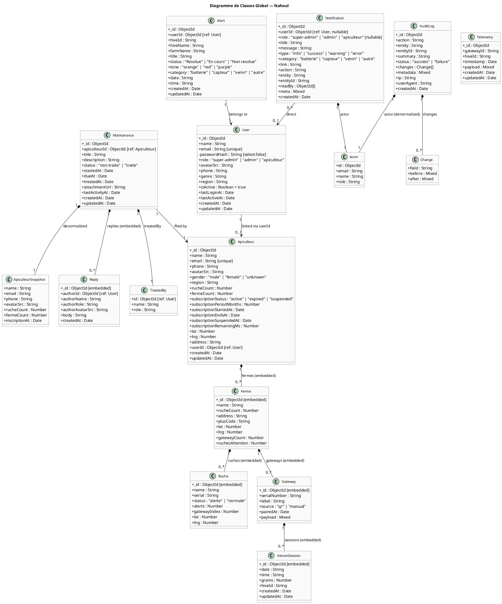
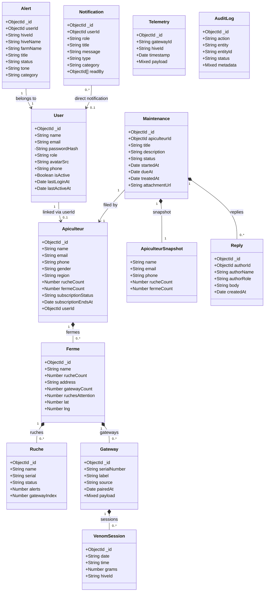
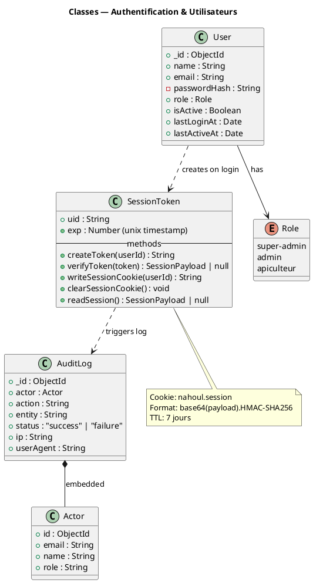
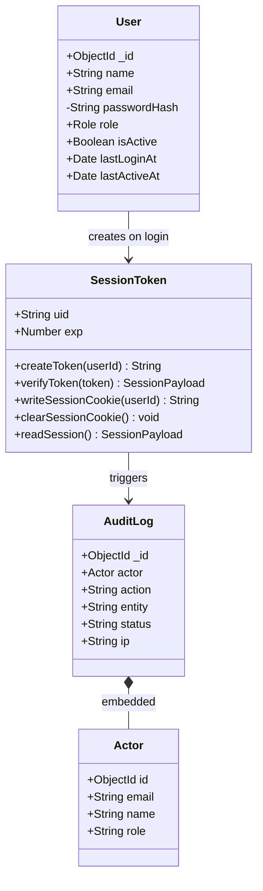
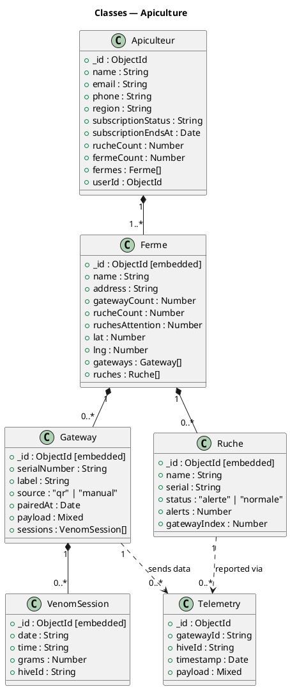
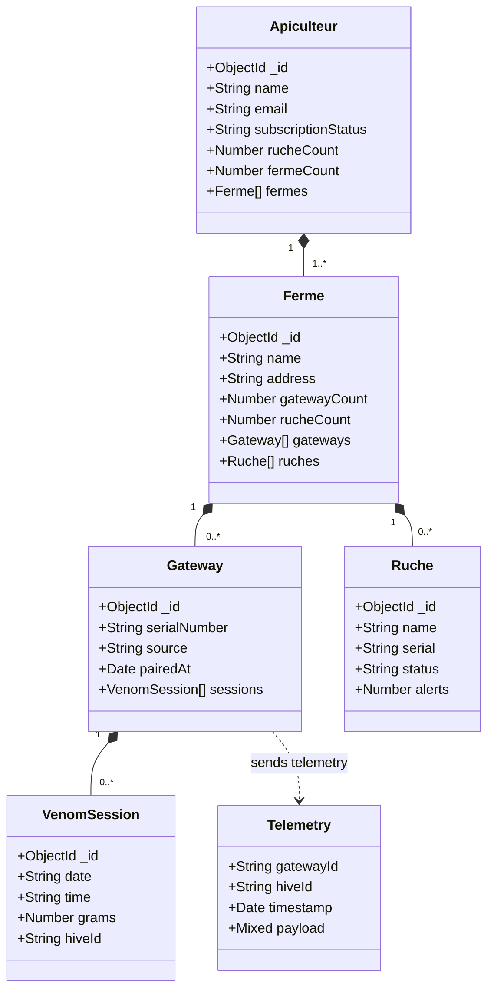
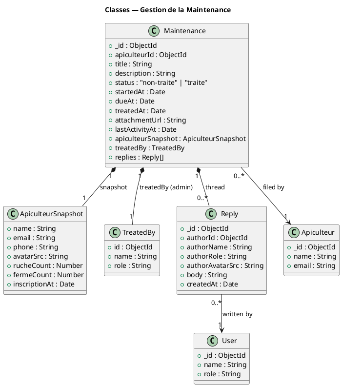
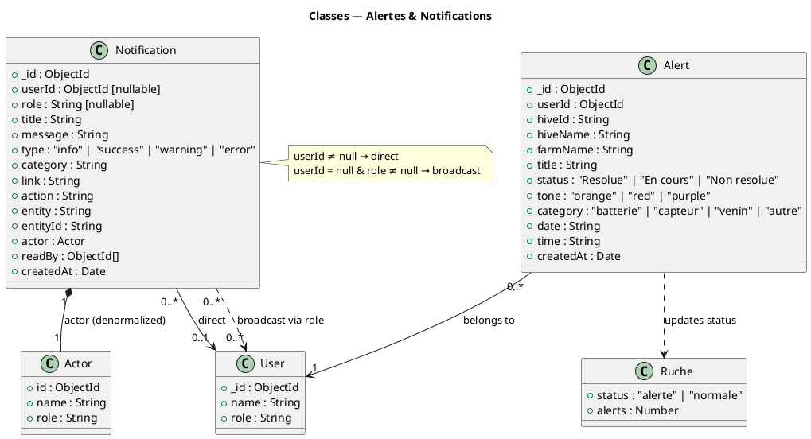
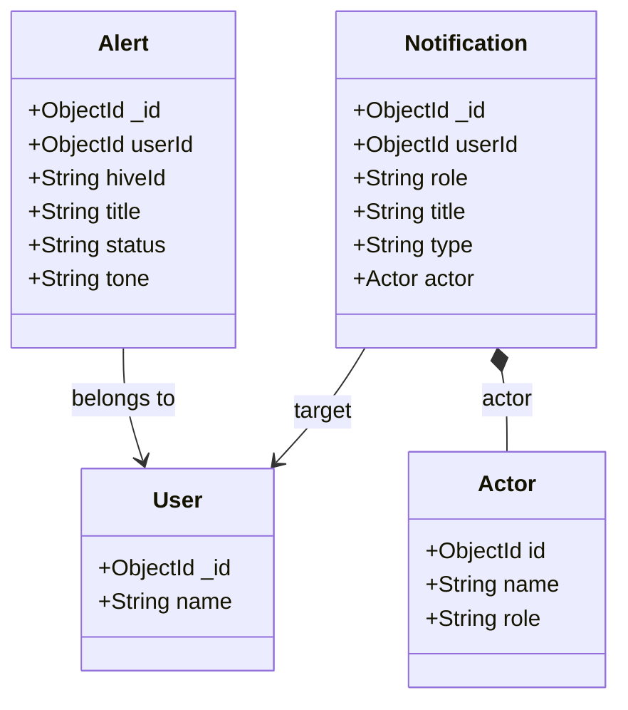

# Diagrammes de Classes — Nahoul / Nectarios

---

## Diagramme Global

### PlantUML

### Mermaid

---

## Diagrammes Secondaires

### A. Domaine Authentification & Utilisateurs

---

### B. Domaine Apiculture (Ferme, Ruche, Gateway)

---

### C. Domaine Maintenance

```mermaid
classDiagram
    class Maintenance {
        +ObjectId _id
        +ObjectId apiculteurId
        +String title
        +String description
        +String status
        +Date startedAt
        +Date dueAt
        +Date treatedAt
        +String attachmentUrl
    }
    class ApiculteurSnapshot {
        +String name
        +String email
        +String phone
        +Number rucheCount
        +Number fermeCount
        +Date inscriptionAt
    }
    class TreatedBy {
        +ObjectId id
        +String name
        +String role
    }
    class Reply {
        +ObjectId _id
        +ObjectId authorId
        +String authorName
        +String authorRole
        +String body
        +Date createdAt
    }
    class Apiculteur {
        +ObjectId _id
        +String name
        +String email
    }
    Maintenance *-- ApiculteurSnapshot : embedded snapshot
    Maintenance *-- TreatedBy : treatedBy
    Maintenance *-- Reply : replies thread
    Maintenance --> Apiculteur : filed by
```

---

### D. Domaine Alertes & Notifications

