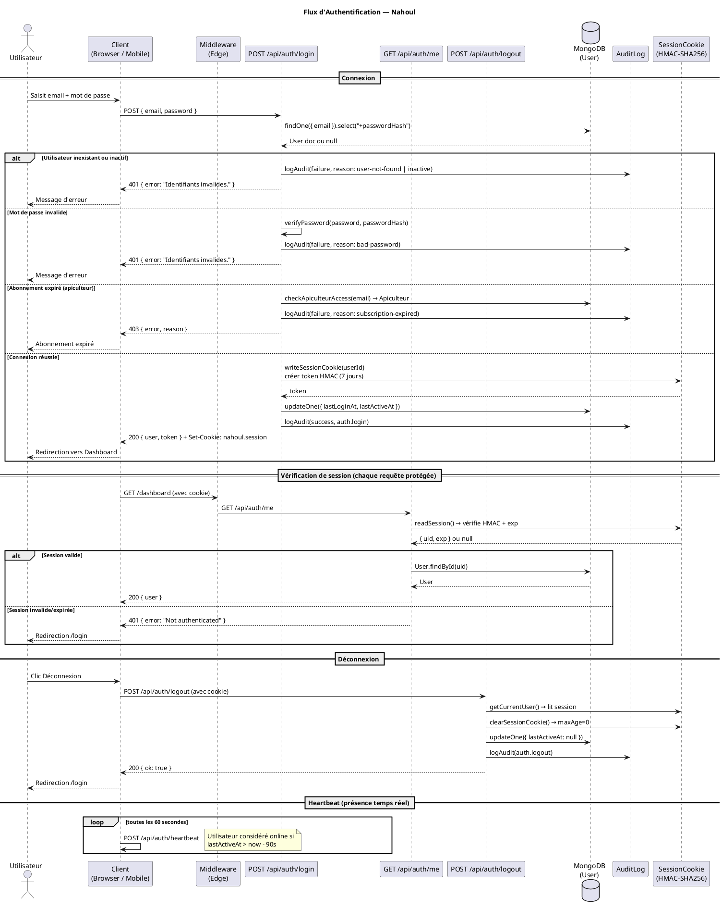
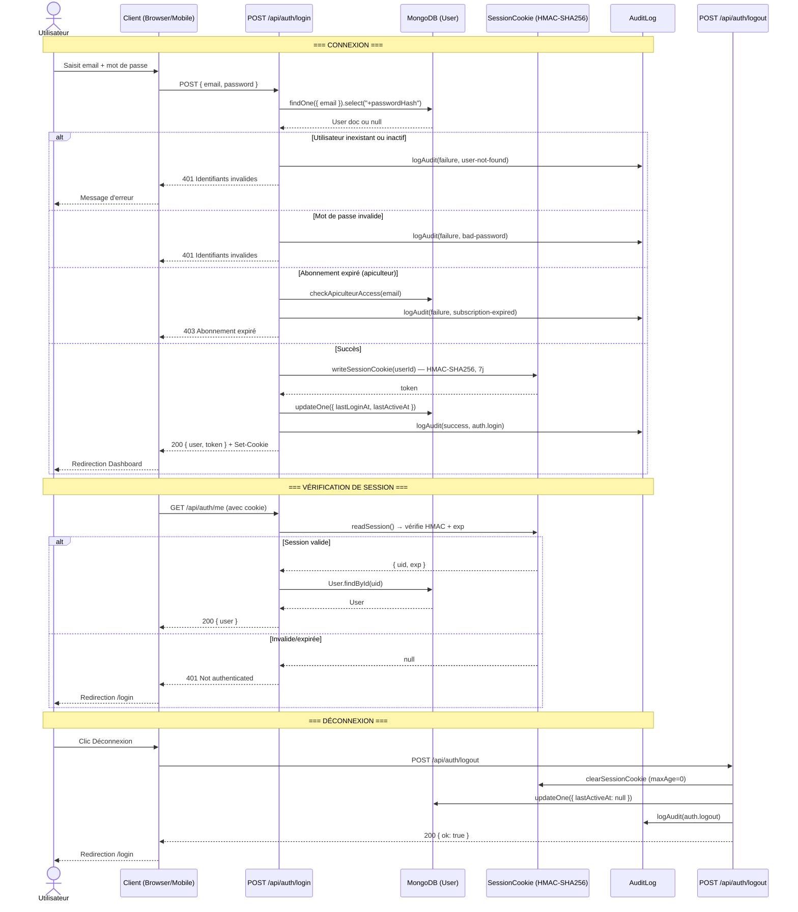
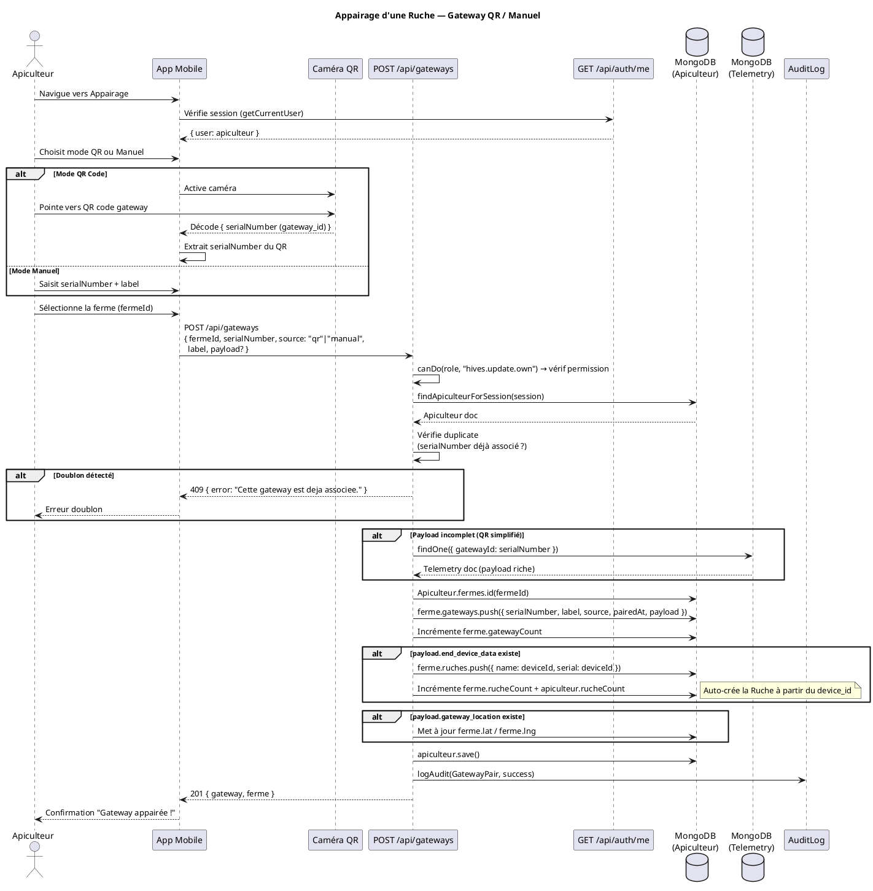
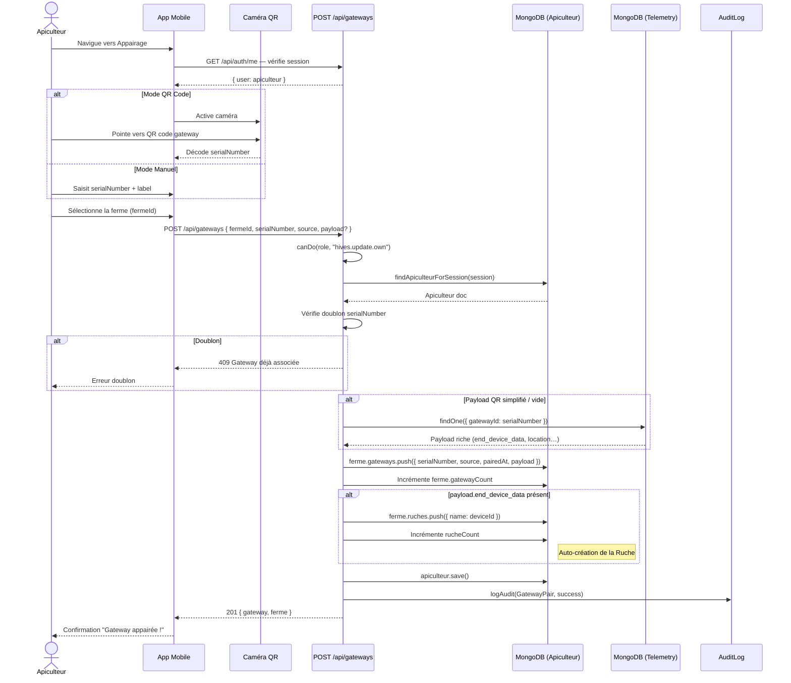
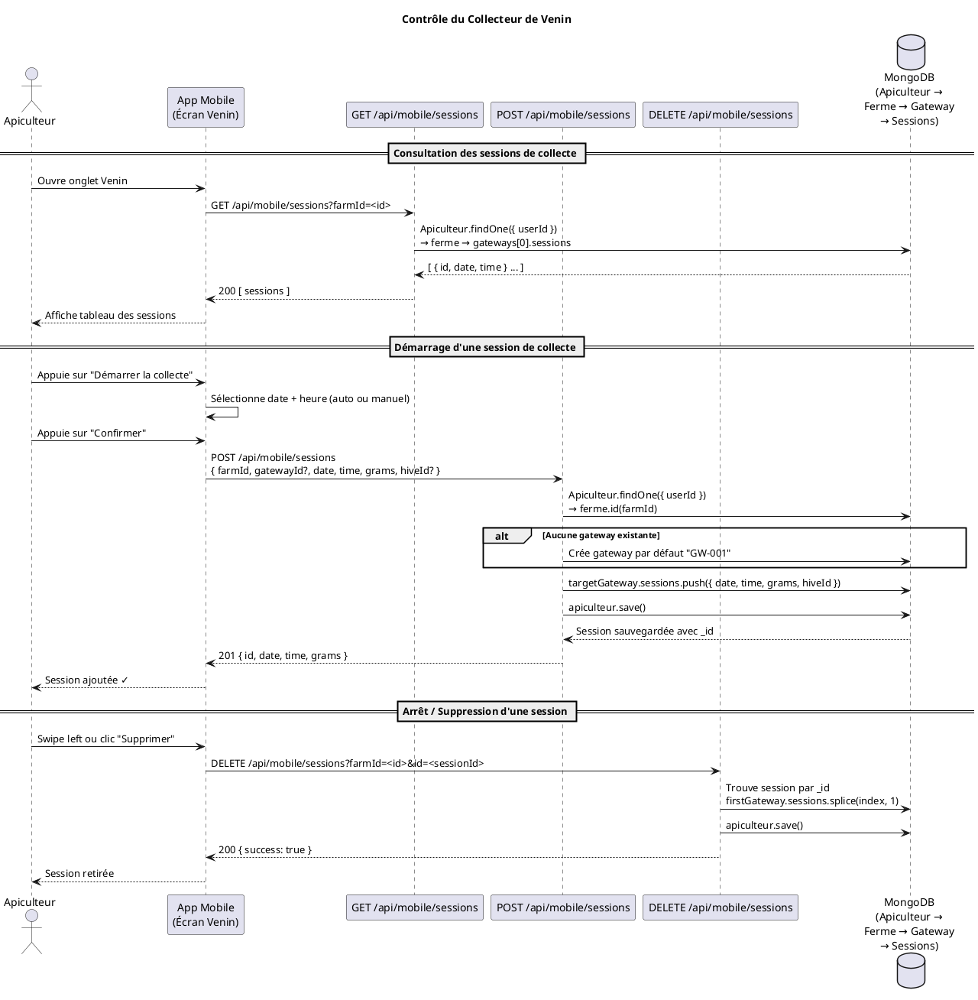
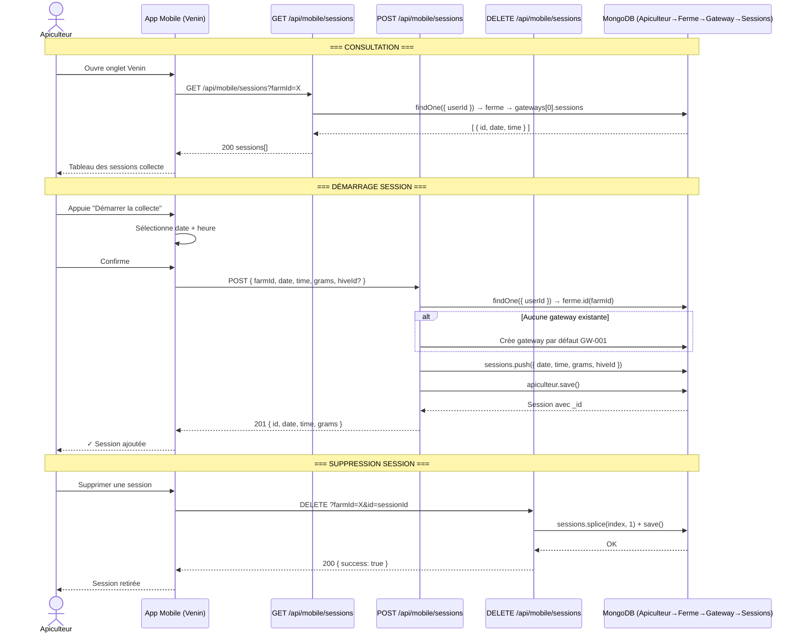
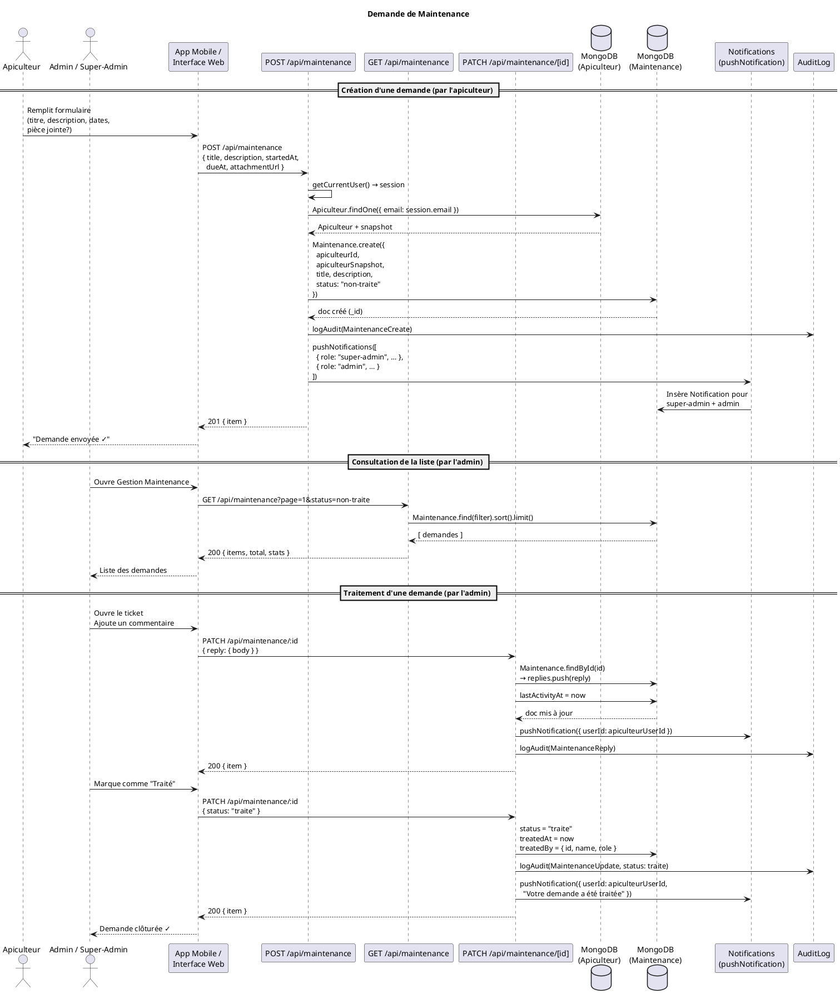
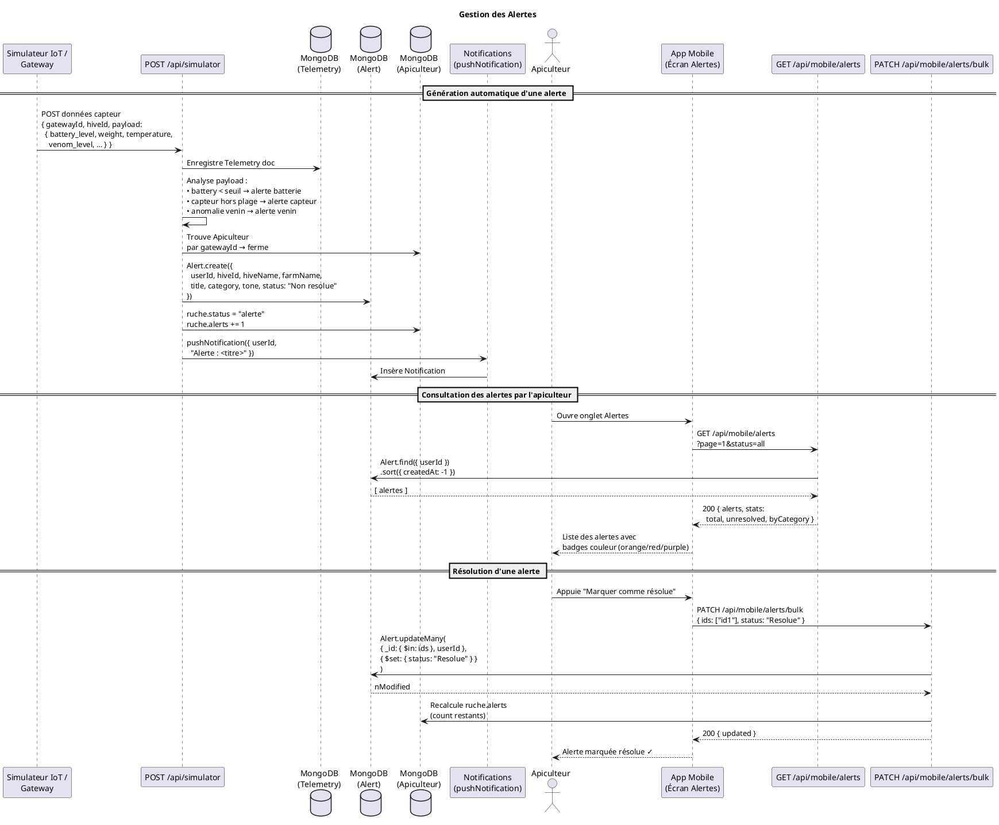

# Diagrammes de Séquence — Nahoul / Nectarios

---

## 1. Flux d'Authentification (Auth Flow)

### PlantUML



### Mermaid



---

## 2. Appairage d'une Ruche (Device Pairing via QR)

### PlantUML



### Mermaid



---

## 3. Contrôle du Contrôleur de Venin (Venom Collection Session)

### PlantUML



### Mermaid



---

## 4. Demande de Maintenance

### PlantUML



### Mermaid

```mermaid
sequenceDiagram
    actor AP as Apiculteur
    actor ADMIN as Admin / Super-Admin
    participant UI as App Mobile / Web
    participant MP as POST /api/maintenance
    participant MG as GET /api/maintenance
    participant MU as PATCH /api/maintenance/[id]
    participant DBA as MongoDB (Apiculteur)
    participant DBM as MongoDB (Maintenance)
    participant NOTIF as Notifications
    participant AL as AuditLog

    Note over AP,AL: === CRÉATION DE DEMANDE ===
    AP->>UI: Remplie formulaire (titre, description, dates)
    UI->>MP: POST /api/maintenance { title, description, startedAt, dueAt }
    MP->>MP: getCurrentUser() → vérifie session
    MP->>DBA: findOne({ email }) → snapshot apiculteur
    DBA-->>MP: Apiculteur doc
    MP->>DBM: Maintenance.create({ apiculteurSnapshot, title, status: "non-traite" })
    DBM-->>MP: doc _id
    MP->>AL: logAudit(MaintenanceCreate)
    MP->>NOTIF: pushNotifications([super-admin, admin])
    NOTIF->>DBM: Insère Notification × 2
    MP-->>UI: 201 { item }
    UI-->>AP: Demande envoyée ✓

    Note over AP,AL: === CONSULTATION (ADMIN) ===
    ADMIN->>UI: Ouvre Gestion Maintenance
    UI->>MG: GET /api/maintenance?status=non-traite
    MG->>DBM: find(filter).sort().limit()
    DBM-->>MG: demandes[]
    MG-->>UI: 200 { items, stats }
    UI-->>ADMIN: Liste des demandes

    Note over AP,AL: === TRAITEMENT (ADMIN) ===
    ADMIN->>UI: Ajoute commentaire
    UI->>MU: PATCH /id { reply: { body } }
    MU->>DBM: replies.push(reply); lastActivityAt = now
    MU->>NOTIF: pushNotification(apiculteurUserId)
    MU->>AL: logAudit(MaintenanceReply)
    MU-->>UI: 200 { item }

    ADMIN->>UI: Marque "Traité"
    UI->>MU: PATCH /id { status: "traite" }
    MU->>DBM: status="traite", treatedAt=now, treatedBy={…}
    MU->>NOTIF: pushNotification(apiculteurUserId, "Demande traitée")
    MU->>AL: logAudit(MaintenanceUpdate)
    MU-->>UI: 200 { item }
    UI-->>ADMIN: Demande clôturée ✓
```

---

## 5. Gestion des Alertes

### PlantUML



### Mermaid

```mermaid
sequenceDiagram
    participant IOT as Simulateur IoT / Gateway
    participant SIM as POST /api/simulator
    participant TELEM as MongoDB (Telemetry)
    participant ALERT_DB as MongoDB (Alert)
    participant API_DB as MongoDB (Apiculteur)
    participant NOTIF as Notifications
    actor AP as Apiculteur
    participant M as App Mobile (Alertes)
    participant AG as GET /api/mobile/alerts
    participant AB as PATCH /api/mobile/alerts/bulk

    Note over IOT,NOTIF: === GÉNÉRATION AUTOMATIQUE D'ALERTE ===
    IOT->>SIM: POST données capteur { gatewayId, hiveId, payload }
    SIM->>TELEM: Enregistre Telemetry doc
    SIM->>SIM: Analyse seuils (batterie, capteur, venin…)
    SIM->>API_DB: Trouve Apiculteur via gatewayId
    SIM->>ALERT_DB: Alert.create({ userId, hiveId, title, category, tone, status: "Non resolue" })
    SIM->>API_DB: ruche.status="alerte"; ruche.alerts++
    SIM->>NOTIF: pushNotification(userId, "Alerte: titre")
    NOTIF->>ALERT_DB: Insère Notification

    Note over AP,AB: === CONSULTATION (APICULTEUR) ===
    AP->>M: Ouvre onglet Alertes
    M->>AG: GET /api/mobile/alerts?page=1&status=all
    AG->>ALERT_DB: find({ userId }).sort({ createdAt: -1 })
    ALERT_DB-->>AG: alertes[]
    AG-->>M: 200 { alerts, stats: { total, unresolved, byCategory } }
    M-->>AP: Liste alertes avec badges couleur

    Note over AP,AB: === RÉSOLUTION D'ALERTE ===
    AP->>M: Marquer comme résolue
    M->>AB: PATCH /api/mobile/alerts/bulk { ids, status: "Resolue" }
    AB->>ALERT_DB: updateMany({ _id: $in ids, userId }, { status: "Resolue" })
    ALERT_DB-->>AB: nModified
    AB->>API_DB: Recalcule ruche.alerts count
    AB-->>M: 200 { updated }
    M-->>AP: ✓ Alerte résolue
```
