# Diagrammes de Cas d'Utilisation — Nahoul / Nectarios

---

## Diagramme Global

### PlantUML

```plantuml
@startuml UC_Global

title Diagramme de Cas d'Utilisation Global — Nahoul

left to right direction
skinparam packageStyle rectangle
skinparam actorStyle awesome

actor "Apiculteur" as AP
actor "Admin" as ADM
actor "Super-Admin" as SA
actor "Système IoT\n(Gateway)" as IOT

rectangle "Système Nahoul" {

  package "Authentification" {
    usecase "Se connecter" as UC_LOGIN
    usecase "Se déconnecter" as UC_LOGOUT
    usecase "Consulter son profil" as UC_PROFILE
  }

  package "Gestion Apiculture" {
    usecase "Voir mes fermes" as UC_FERMES
    usecase "Voir mes ruches" as UC_RUCHES
    usecase "Appairer une gateway (QR/Manuel)" as UC_PAIR
    usecase "Consulter télémétrie temps réel" as UC_TELEM
    usecase "Gérer sessions de collecte venin" as UC_VENIN
  }

  package "Gestion des Alertes" {
    usecase "Recevoir alertes automatiques" as UC_ALERT_AUTO
    usecase "Consulter ses alertes" as UC_ALERT_VIEW
    usecase "Résoudre / clôturer une alerte" as UC_ALERT_RESOLVE
  }

  package "Maintenance" {
    usecase "Créer une demande de maintenance" as UC_MAINT_CREATE
    usecase "Consulter ses demandes" as UC_MAINT_VIEW_AP
    usecase "Gérer toutes les demandes" as UC_MAINT_MANAGE
    usecase "Traiter / répondre à une demande" as UC_MAINT_TREAT
    usecase "Exporter demandes (CSV)" as UC_MAINT_EXPORT
  }

  package "Gestion Utilisateurs" {
    usecase "Gérer les apiculteurs" as UC_API_MGMT
    usecase "Gérer les abonnements" as UC_SUB_MGMT
    usecase "Gérer les admins" as UC_ADM_MGMT
    usecase "Créer / désactiver un compte" as UC_USER_CREATE
  }

  package "Tableau de Bord" {
    usecase "Voir dashboard opérationnel" as UC_DASH
    usecase "Voir statistiques système" as UC_STATS
  }

  package "Notifications" {
    usecase "Recevoir notifications" as UC_NOTIF_RECV
    usecase "Envoyer notification broadcast" as UC_NOTIF_SEND
    usecase "Marquer notifications lues" as UC_NOTIF_READ
  }

  package "Système & Audit" {
    usecase "Consulter journal d'audit" as UC_AUDIT
    usecase "Recevoir données télémétrie" as UC_IOT_DATA
    usecase "Déclencher alerte automatique" as UC_IOT_ALERT
  }

}

' Apiculteur
AP --> UC_LOGIN
AP --> UC_LOGOUT
AP --> UC_PROFILE
AP --> UC_FERMES
AP --> UC_RUCHES
AP --> UC_PAIR
AP --> UC_TELEM
AP --> UC_VENIN
AP --> UC_ALERT_VIEW
AP --> UC_ALERT_RESOLVE
AP --> UC_MAINT_CREATE
AP --> UC_MAINT_VIEW_AP
AP --> UC_NOTIF_RECV
AP --> UC_NOTIF_READ

' Admin
ADM --> UC_LOGIN
ADM --> UC_LOGOUT
ADM --> UC_DASH
ADM --> UC_API_MGMT
ADM --> UC_SUB_MGMT
ADM --> UC_MAINT_MANAGE
ADM --> UC_MAINT_TREAT
ADM --> UC_MAINT_EXPORT
ADM --> UC_NOTIF_RECV
ADM --> UC_NOTIF_READ

' Super-Admin
SA --> UC_LOGIN
SA --> UC_LOGOUT
SA --> UC_DASH
SA --> UC_STATS
SA --> UC_ADM_MGMT
SA --> UC_USER_CREATE
SA --> UC_API_MGMT
SA --> UC_SUB_MGMT
SA --> UC_MAINT_MANAGE
SA --> UC_MAINT_TREAT
SA --> UC_MAINT_EXPORT
SA --> UC_AUDIT
SA --> UC_NOTIF_RECV
SA --> UC_NOTIF_READ
SA --> UC_NOTIF_SEND

' IoT System
IOT --> UC_IOT_DATA
UC_IOT_DATA .> UC_IOT_ALERT : <<include>>
UC_IOT_ALERT .> UC_ALERT_AUTO : <<include>>

' Includes
UC_ALERT_AUTO .> UC_NOTIF_RECV : <<include>>
UC_MAINT_CREATE .> UC_NOTIF_RECV : <<include>>
UC_MAINT_TREAT .> UC_NOTIF_RECV : <<include>>

@enduml
```

### Mermaid

> **Note:** Mermaid ne supporte pas nativement les diagrammes UML "Use Case". La représentation ci-dessous utilise un graphe orienté avec des nœuds stylisés pour approximer le même contenu.

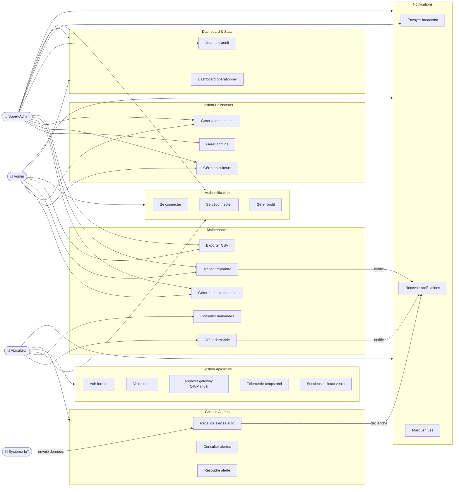

---

## Diagrammes Secondaires

### A. Cas d'utilisation — Authentification

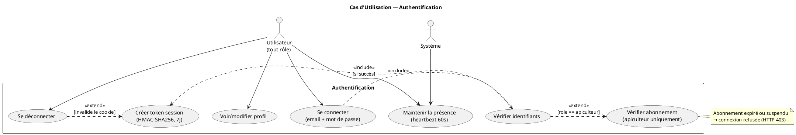

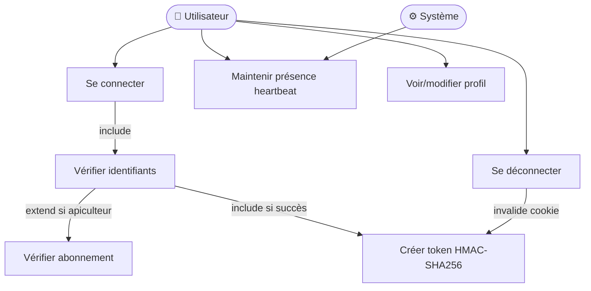

---

### B. Cas d'utilisation — Appairage Ruche

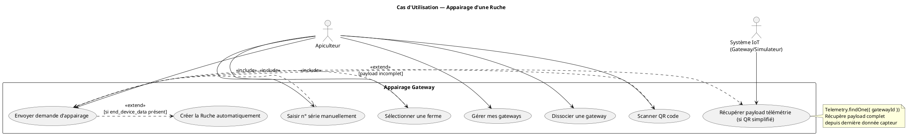

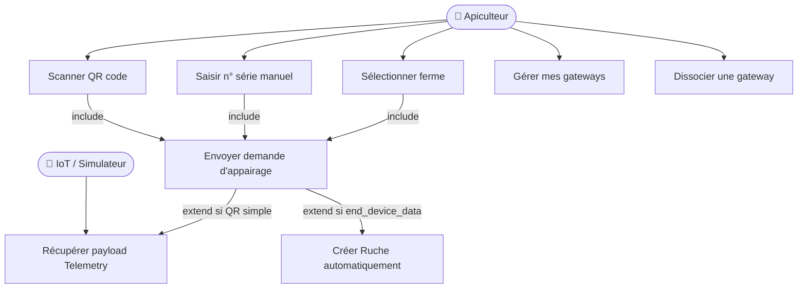

---

### C. Cas d'utilisation — Collecte de Venin

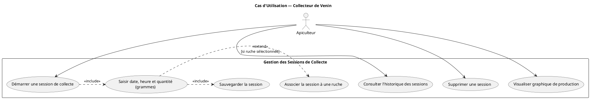

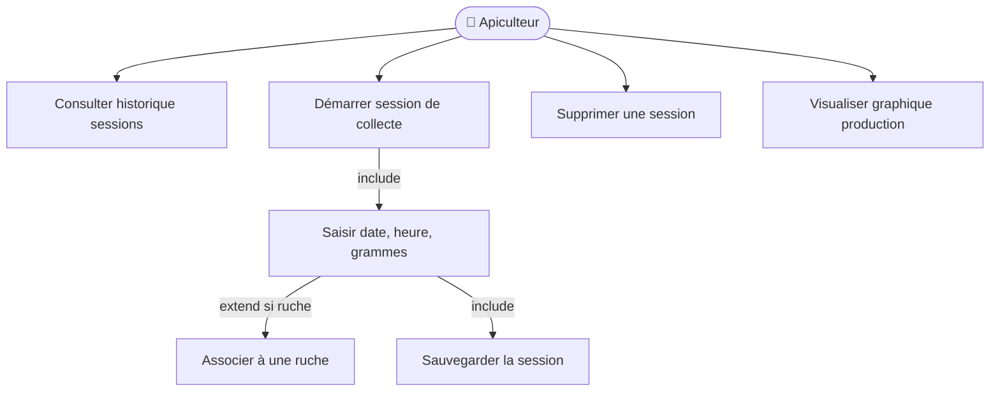

---

### D. Cas d'utilisation — Gestion des Alertes

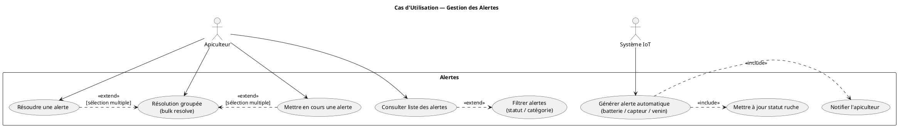

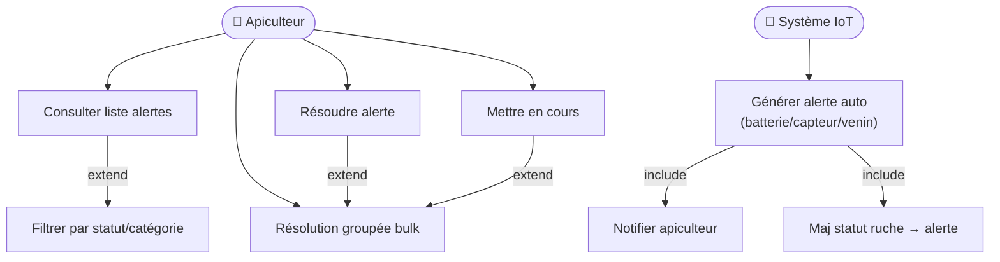

---

### E. Cas d'utilisation — Maintenance

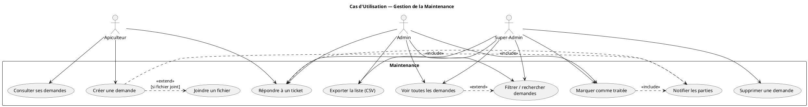

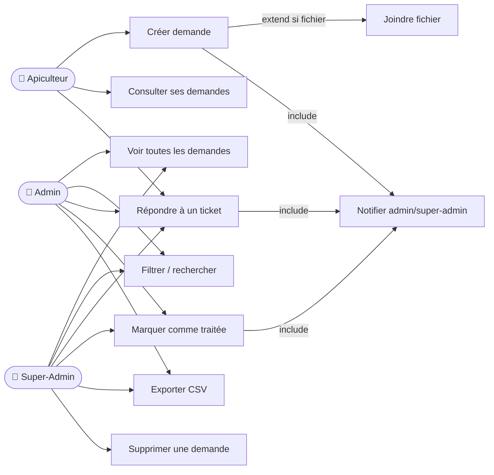

---

### F. Cas d'utilisation — Dashboard & Audit (Super-Admin / Admin)

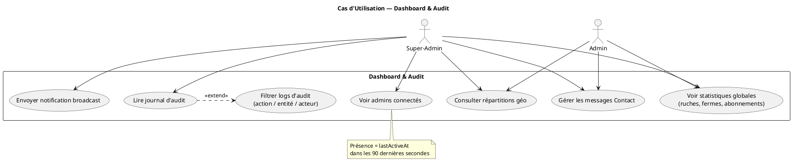

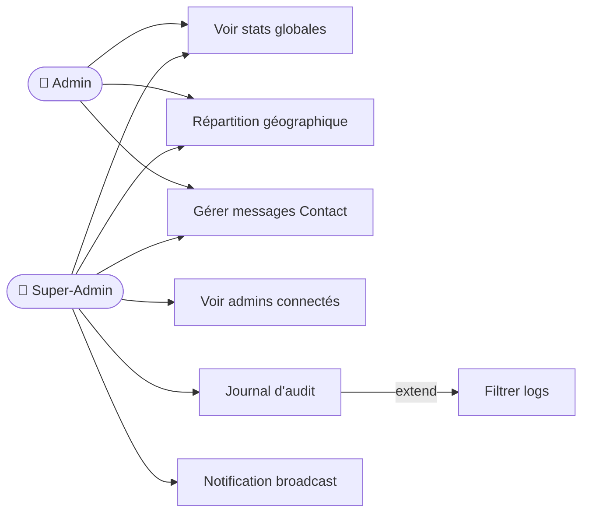
